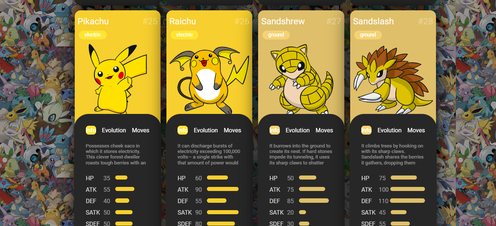
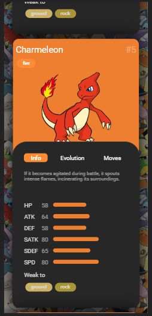

# Pokedex da DIO

Este é um projeto desenvolvido como parte do curso da Digital Innovation One (DIO) para criar uma Pokedex, uma enciclopédia virtual de Pokémon.

## Visão Geral

A Pokedex da DIO é uma aplicação web que permite aos usuários:

- Pesquisar informações detalhadas sobre diferentes Pokémon.
- Visualizar imagens e estatísticas de Pokémon.
- Explorar diferentes gerações de Pokémon.
- Adicionar Pokémon à sua lista de favoritos.




## Tecnologias Utilizadas

Este projeto foi construído utilizando as seguintes tecnologias:

- HTML5
- CSS3
- JavaScript
- [PokéAPI](https://pokeapi.co/): Uma API pública para informações de Pokémon.

## Como Usar

1. Clone este repositório:

   ```bash
   git clone https://github.com/seu-usuario/pokedex

2. Navegue até o diretório do projeto:

   ```bash
   cd pokedex-dio

3. Abra o arquivo index.html em seu navegador web.
4. Use a Pokedex para pesquisar e explorar informações sobre Pokémon.
